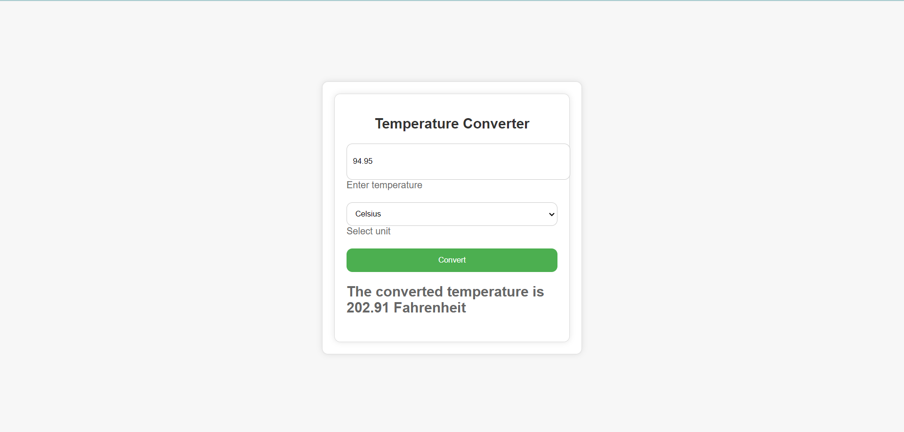

 ## Temperature Converter

 ## Description

This temperature converter project allows users to input a temperature value and select either Celsius or Fahrenheit for conversion. Implemented with HTML for structure, CSS for basic styling, and JavaScript for functionality, it ensures input validation to handle errors like invalid numbers or missing units. Upon clicking the convert button, the program dynamically computes and displays the converted temperature instantly. It serves as a practical demonstration of basic web development concepts, focusing on user interaction and real-time data manipulation through event handling.

# Screenshots

## Features
- Allows input of temperature value and selection of Celsius or Fahrenheit units.
- Validates input to ensure it's a valid number and that a unit is selected.
- Converts temperature dynamically based on selected unit using appropriate formulas.
- Updates and displays the converted temperature instantly on the webpage.
- Demonstrates basic web development concepts like event handling, input validation, and DOM manipulation using HTML, CSS, and JavaScript.

## Author

Akanksha Saraf

